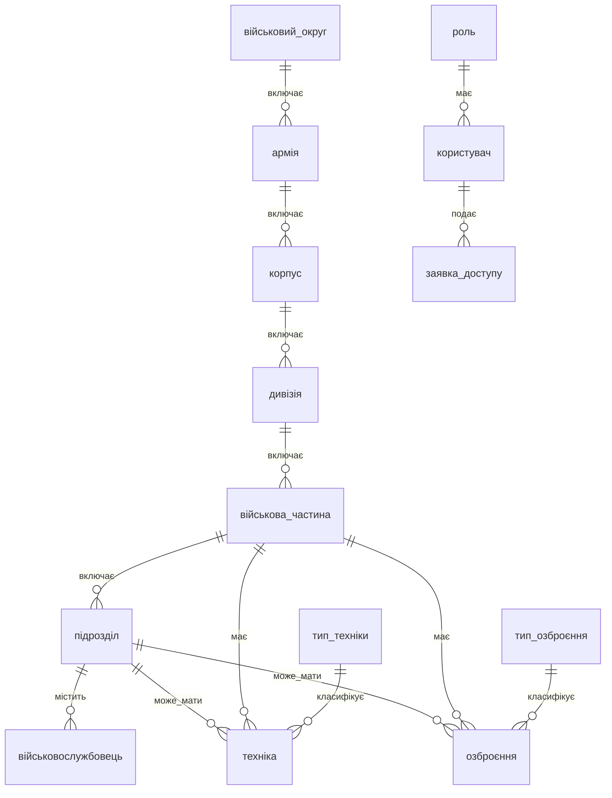

## ER-діаграма (Mermaid)

### Пояснення сутностей
- військовий_округ: назва, штаб, командувач
- армія: номер, назва, належить до округу
- корпус: номер, належить до армії
- дивізія: номер, тип, належить до корпусу
- військова_частина: номер, назва, належить до дивізії
- підрозділ: тип, назва, належить до військової частини
- військовослужбовець: ПІБ, звання, посада, дати
- тип_техніки/тип_озброєння: довідники
- техніка/озброєння: ідентифікатори, модель, стан, закріплення
- споруда: назва, тип, адреса, прив'язка до частини
- роль/користувач/заявка_доступу: доступ до системи

### Вікна застосунку
- Логін: вхід користувача, "Забули пароль" (інформує звернутись до адміністратора)
- Головне вікно: тулбар з кнопками Перегляд / CRUD / Запити / Користувачі
- Запити: список 10 вбудованих SQL, параметри (int/str/date), результати у таблиці
- CRUD: буде додано (екрани для додавання, редагування, видалення, пошуку)
- Користувачі: буде додано (керування ролями, обробка заявок гостей)

### Ролі доступу
- Адміністратор: повний доступ, управління користувачами, заявки гостей
- Оператор: CRUD, пошук, виконання SQL-запитів
- Авторизований: перегляд, пошук, виконання вбудованих SQL-запитів
- Гість: тільки перегляд, може надіслати заявку адміністратору
