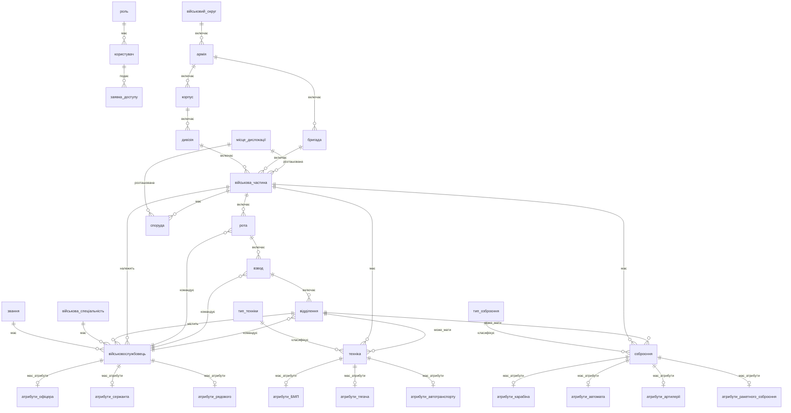

# ER-діаграма системи управління військовим округом

## Повна ER-діаграма (Mermaid)

## Опис сутностей

### Військова ієрархія
- **військовий_округ**: найвищий рівень військової організації
- **армія**: об'єднання корпусів та бригад
- **корпус**: об'єднання дивізій
- **дивізія**: основні тактичні з'єднання
- **бригада**: окремі військові з'єднання
- **військова_частина**: основні адміністративні одиниці

### Підрозділи
- **рота**: підрозділи військових частин
- **взвод**: підрозділи рот
- **відділення**: найменші підрозділи

### Особовий склад
- **військовослужбовець**: особовий склад військових частин
- **звання**: військові звання з категоріями та порядком
- **військова_спеціальність**: військові спеціальності з кодами

### Техніка та озброєння
- **тип_техніки**: класифікація військової техніки
- **техніка**: військова техніка з інвентарними номерами
- **тип_озброєння**: класифікація військового озброєння
- **озброєння**: військове озброєння з серійними номерами

### Інфраструктура
- **місце_дислокації**: місця дислокації військових частин
- **споруда**: споруди військових частин

### Управління доступом
- **роль**: ролі користувачів системи
- **користувач**: користувачі системи
- **заявка_доступу**: заявки на доступ до системи

## Ключові особливості моделі

### 1. Гнучка ієрархія
- Військові частини можуть належати або дивізії, або бригаді
- Підтримка як традиційної структури (округ → армія → корпус → дивізія → частина)
- Так і спрощеної структури (округ → армія → бригада → частина)

### 2. Детальна структура підрозділів
- Повна ієрархія: частина → рота → взвод → відділення
- Кожен рівень має свого командира
- Військовослужбовці призначаються до відділень

### 3. Специфічні атрибути
- Окремі таблиці для атрибутів офіцерів, сержантів, рядових
- Окремі таблиці для атрибутів різних типів техніки та озброєння
- Можливість розширення без зміни основної структури

### 4. Командування
- Офіцери можуть командувати будь-якими підрозділами
- Сержанти та рядові можуть командувати тільки взводами та відділеннями
- Автоматичне оновлення призначень командирів

### 5. Призначення техніки та озброєння
- Техніка та озброєння можуть бути призначені до частини та/або відділення
- Валідація того, що відділення належить до частини
- Можливість переміщення між підрозділами

## Обмеження та валідація

### 1. Унікальність
- Інвентарні номери техніки унікальні
- Серійні номери озброєння унікальні
- Номери частин унікальні в межах дивізії/бригади

### 2. Формати даних
- Інвентарні та серійні номери: тільки великі літери та цифри
- Коди спеціальностей: 3 цифри
- Координати: формат "широта, довгота"

### 3. Логічні обмеження
- Дата прийняття на службу не може бути раніше дати народження + 16 років
- Рік випуску техніки: 1940 - поточний рік
- Військова частина повинна належати або дивізії, або бригаді

### 4. Ієрархічні обмеження
- Відділення належить до взводу
- Взвод належить до роти
- Рота належить до військової частини
- Техніка та озброєння не можуть бути призначені до відділення іншої частини